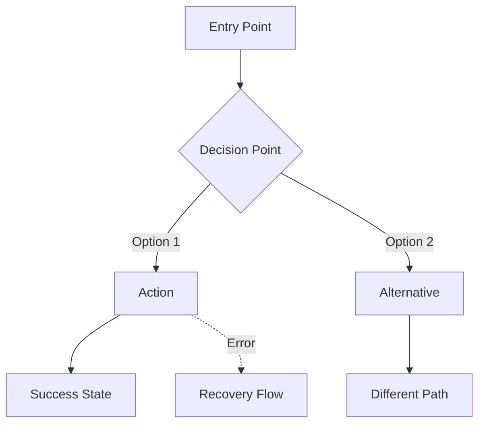

# Step 3/7: Map User Journeys

> Create visual flow diagrams for key interactions

## Objective

Visualize how users move through the experience.

## Inputs Required

- User scenarios from spec
- Experience principles

## Outputs Produced

- Mermaid journey diagrams
- Touchpoint inventory

---

## Step 3: Map User Journeys

### Your Objective
Create visual journey maps that show how users flow through key interactions.

### Facilitation Questions
1. **What's the very first thing a user sees/does?**
2. **At each step, what question is in the user's mind?**
3. **Where might they get stuck or confused?**
4. **What happens when something goes wrong?**

### Journey Diagram Format (Mermaid)

### Journeys to Map
1. **Primary journey**: The main task users come to accomplish
2. **Onboarding journey**: First-time user experience
3. **Recovery journey**: What happens when things go wrong
4. **Power user journey**: Shortcuts and efficiency patterns

### Output
Mermaid diagrams for at least the primary and recovery journeys.

---

## Checkpoint

Before proceeding to the next step, confirm:

> **Do these journeys cover the critical paths? Happy and unhappy?**

## Tips

- 💡 The error path is often more important than the happy path
- 💡 Show decision points - where users choose direction
- 💡 Note emotional state at key moments

---

## Navigation

⬅️ Previous: [Define Core Experience](./define-experience.md)

➡️ Next: [Establish Visual Foundation](./visual-foundation.md)

---

_UX Design workflow - Step 3 of 7_
_Project: neuro-acoustic-analyzer | Track: solo | Agent: ux-designer_
